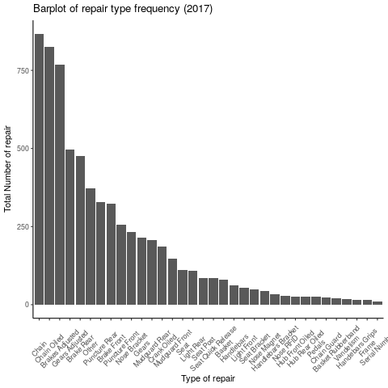
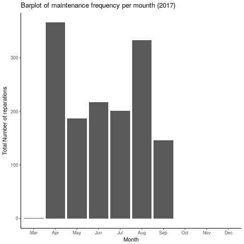
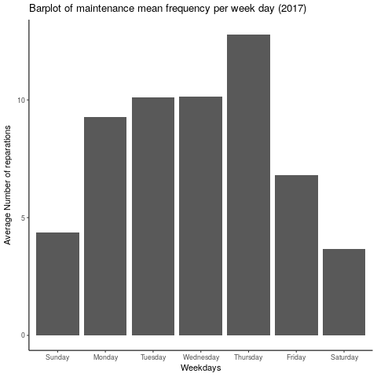
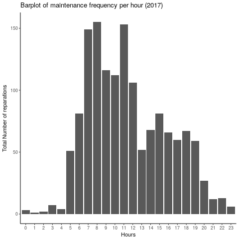
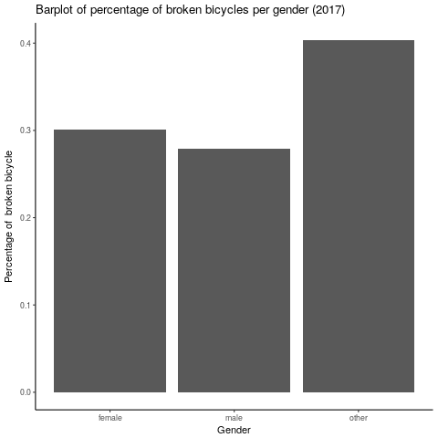
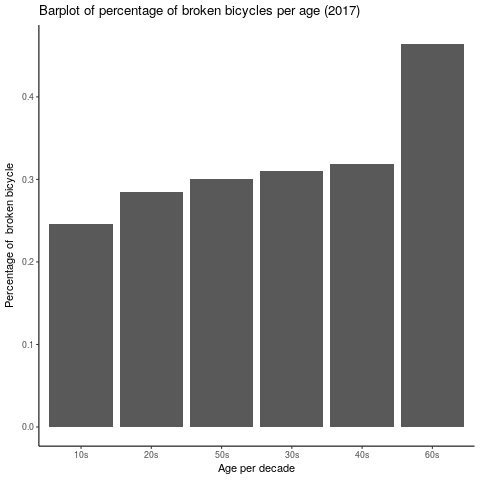
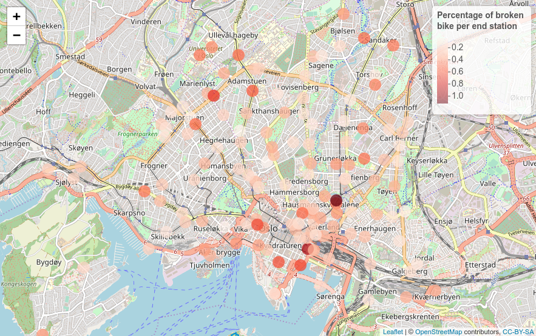
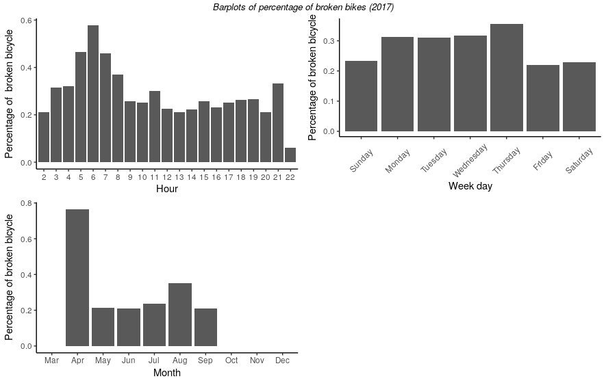
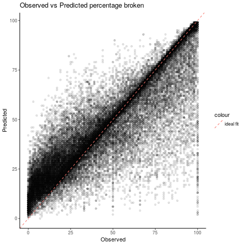

# Intro

In recent years bicycle sharing has become more and more present in Oslo. It provides an alternative to other modes of transport as well as filling the gaps left by public transports. They are many benefits provided by bicycle sharing: times of commuting trips can be potentially reduced, no bicycle theft, health improvement...

The main objective of this project is to successfully flag the call for maintenance of a bike. The benefits of such prediction would be obvious for the maintenance teams and thus for bike sharing users.You can find all the R code used for this work [here](https://github.com/GregoireJan/PredictiveMaintenanceBike).

This project is organized as follows:

1. Data analysis
    + Maintenance log
    + Bike trips log
    + Merging
2. Prediction
    + Features
    + Random Forest
3. Conclusion

# Data analysis

## Maintenance Log

In order to make a prediction on the maintenance we need to know when the bikes get broken. To do this we have a maintance log which contains all the repairs for the year 2017.
This file contains every single type of repair done on a bike. Since we are only interested in knowing that the bike was repaired and when it was done we can simply aggregate the dataset per *bike ID* and *date*.

Let's be curious at first and check what type of repair is most common. The bar plot shows that we have 3 groups that seems to create most of the repair: chains, breaks and gears.


Let's have a look now at the aggregated data per month, weekday and hour to see if we can spot any patterns.

* The bar plot of the frequency per month shows that data starts in April (that is the start of the bike sharing season in Oslo) and ends in Septembre (end of provided file). The mean for a month is ~142 repairs. April and August look a bit busier.


* The bar plot of the frequency per weekday shows that weekends seems quieter and that Thursday is the busiest day. We can wonder if weekends are quieter due to low repair staff avaibility. However we would expect Mondays to be much busier in such case. The mean for a day is at ~8 repairs.


* The bar plot of the frequency per hour show that mornings are much busier than afternoon. One can think that is due to the bikes being broken late at night the day before.


## Bike trips log

The bike trips log represents all the trips from April to September 2017. This dataset contains a *bike id* for each *trip id* as well as the following features:

* Birth year and gender of the user
* Localisation and number of locks of the start and end station
* Time of the start and end of the trip
* Trip duration

<!--
trip_id, bike_id, start_station_id, end_station_id, trip_started_at, trip_ended_at, trip_duration, member_birth_year, member_gender, start_station_title, start_station_subtitle, start_station_number_of_locks, 
start_station_latitude, start_station_longitude, end_station_title, end_station_subtitle, end_station_number_of_locks, end_station_latitude, end_station_longitude)
-->

## Merging

Before we can merge the bike trips and the maintance log together we have to make an assumption: the last trip before repair time has caused the bike to break. There are some limitations to this assumption since the bike could have been broken on some trips before (but not reported) or simply broken on the deck. But I believe we could assume that our assumption is correct most of time.

So first we split the end time of each trip into month, day and hour and weekday for the bike trips log.
Then the dataset is sorted per *bike id* per end time before copying the trip start time of the next trip.

```python
# Sort the data per bike_id and trip end time
tripsdt <- as.data.table(trips[order(trips$bike_id,trips$trip_ended_at),])
# Copy the trip start time of the next trip 
tripsdt[ , next_trip := shift(trip_started_at,type="lead")]
tripsdt <- tripsdt[, c(1:6,28,7:27)]
# NA value when the bike id changes
tripsdt <- tripsdt %>% 
  group_by(bike_id) %>% 
  mutate(next_trip= ifelse(row_number()==n(), NA, next_trip))
tripsdt$numnext <-tripsdt$next_trip
# Convert time to POSIX
tripsdt$next_trip <- as.POSIXct(tripsdt$next_trip, origin="1970-01-01",tz="UTC")
```

Now we are ready to merge both logs together using the assumption mentionned earlier. I used SQL to simplify the task!

```
### Merge maintenance and bike trip log using SQL
library(sqldf)

# The merge is done assuming that the last trip before the time of repair has caused the bike to break
mge <- sqldf("
  SELECT *
  FROM tripsdt t LEFT JOIN agg a
  ON t.bike_id = a.bike_id
  AND a.ndate BETWEEN t.numend AND t.numnext
")
```

Ok so now we have flagged which trip broke a bike: 1 for broken - 0 otherwise. Then I have performed some cleaning before the next steps: removing rows with NAs for gender or birth year and birth years outside the range 1947-2001 (users must be 16 to have an account).

Let's analysis who,where and when the bicycles are being broken:

* Gender: the bar plot below does not show any clear distinction between females and males where the percentage of broken bicycles varies around 0.3%. The other category is not relevant here  since it contains ony 11 cases.


* Age: the bar plot below shows that the older the user the bigger the percentage of broken bicycles.


* End stations: the map below does not show any clear areas where the percentage of broken bicycles would have been higher.


* Time: the bar plots below show that early mornings, the months of April and August as well as Thrusdays have higher percentages.


Before moving forward we will have a look at the correlation between our "broke" flag and the other numerical features:

|   bike_id   | end_station_id | trip_duration  | member_birth_year |    broke    | cumduration  |
|:-----------:|:--------------:|:--------------:|:-----------------:|:-----------:|--------------|
| 0.001222964 | 0.001560858    | 0.003753742    | -0.002532061      | 1.000000000 | -0.010912075 |

We can see that none of the numerical features have a high correlation with the flag.

# Prediction

## Additionnal features

The next step is to compute some additionnal features:

```python
# Flag is TRUE on first trip after reparir - otherwise false
mgena$flag <- c(FALSE,diff(mgena$broke) < 0 | diff(mgena$bike_id) != 0)
# Flag: 0 if bike does not break - 1 if bike breaks at some point
mgena$brokemax <- with(mgena, ave(broke, cumsum(flag == TRUE), FUN = max))
# Cumulative duration until a bike breaks
mgena$cumduration <- with(mgena, ave(trip_duration, cumsum(flag == TRUE), FUN = cumsum))
# Index of trips for each bike until it breaks - set back to 1
mgena$groupindex <- with(mgena, ave(bike_id, cumsum(flag == TRUE), FUN = seq_along))
# Maximum number of trips for each bike until it breaks
mgena$groupmax <- with(mgena, ave(groupindex, cumsum(flag == TRUE), FUN = max))
# Percentage brokne = how much the bike is broken / 100% when broke
mgena$percm <- mgena$groupindex/mgena$groupmax
```

* *cumulative trip duration*: cumulative sum of the *trip duration*
* *group index*: index within each group
* *group index max*: maximum index for each group
* *group broke flag*: maximum flag value for each group

A group here is a sub-group of *bike id* where the boundaries are defined by the first trip after its repair until the next trip where it breaks, i.e. every trips for a given bike until it breaks.

Finally we can compute a last feature that defines how "broken" is the bicycle by dividing the *group index* by *group max*. And now we have the outcome we want to predict! We will call it *percentage broken*.It is fair to say here that we have made another assumption which is that the bicycles are getting broken in a linear way.

## Random Forest

First we only want to keep that bikes group that have been broken (we use our *group index max* for this purpose). Then we retain the following features only:

* Bike id
* End station id
* Trip duration
* Member birthyear
* Member gender
* Date: mount, hour and weekday
* Cummulative duration
* Percentage borken (our outcome)

Now we can split our data into a training (70% of the trips) and testing dataset (30% of the trips).

We are now ready to train our model! 
*Ranger* is a fast implementation of random forests (Breiman 2001) or recursive partitioning.

```python
# Random Forest - Ranger from CARET
fitrfm<- train(percm ~ .,data=trainingr,
                     method = "ranger",
                     trControl = trainControl(method="cv", number = 5, verboseIter = T, classProbs = T),
                     num.trees = 100,
                     importance = "permutation")
```

Before taking a look at the predictions using our trained model let's see the importance of the features:

|     Features      | Weights |
|:-----------------:|:-------:|
|cumduration        |1.000e+02|
|bike_id            |5.002e+01|
|monthAug           |2.673e+01|
|monthJul           |1.716e+01|
|monthMay           |1.386e+01|
|monthJun           |1.056e+01|
|monthSep           |8.242e+00|
|monthApr           |2.549e+00|
|wdayThursday       |8.692e-01|
|wdayWednesday      |6.368e-01|
|wdayFriday         |6.069e-01|
|hour               |5.494e-01|
|wdaySaturday       |4.309e-01|
|wdayTuesday        |4.056e-01|
|wdayMonday         |3.260e-01|
|trip_duration      |2.644e-01|
|end_station_id     |6.339e-02|
|member_birth_year  |4.544e-02|
|member_genderother |1.038e-02|
|member_gendermale  |9.616e-03|

This is not surprising to see the cumulative duration as the top factor for the decision tree. However the *month* seems to have a great impact as well and we could wonder if this is justified. The dataset we use contains only bicycles trips from 2017. One can wonder if the *month* feature is really representative. We would need data from other years to confirm it. We will then train our model another time but without the *month* feature this time. Here are the metrics to assess our models after predicting our outcome *percentage borken* using the testing dataset:

|              |     R Square   | Root Mean Square Error |
|:------------:|:--------------:|:----------------------:|
| Model 1 (All features) |      0.93      |           7.8          |
|   Model 2 (All features without month)   |      0.81      |          12.1          |


Even though the R square value is decreasing by 12 points it is still a fairly good achievement and so is the Root Mean Square error. As a reminder, a perfect R Square value would be 1 and we want the Root Mean Square error to be as small as possible, e.g. for model 2 we are on average 12.1 points away from the true value.

We can now visualise our prediction vs the observed value for the model 2 on the testing dataset:


We can see that most of the prediction falls around the perfect fit line. The prediction seems to be more accurate above the oberserved value of 50% which is in our interest.

# Conclusion

Since we have fairly good accuracy even for the model 2 we could set a flag with a high *percentage broken* prediction. If we were to choose a value of 90% using model 2 we would have only missed 1.7% of the broken bikes for the testing dataset.

Further work could be done to improve the hyper parameters of the model. We could as well challenge our assumption stating that the bicycles get broken in a liner way.

If you enjoyed this project and/or have any comments please feel free to contact me!


